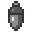
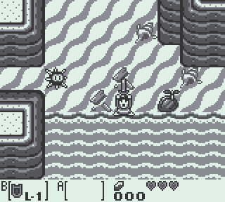

#  Goholint



An incomplete, buggy and suboptimal GameBoy emulator written in Go purely for
fun. It displays pixels, makes noises and can export GIFs. Hopefully it can
also prove remotely informative to anyone wanting to get into emulators!


## Disclaimer

All code available here is raw, broken, doesn't follow any specific kind of
workflow and isn't guaranteed to work in any way or form.

It might contain blatant errors, awkward workarounds and the occasional
profanity in comments or commit messages. Golang at least guarantees that
the formatting is somewhat consistent.

Those are the main reasons why this code used to be self-hosted for so long.


## Getting Goholint

The easiest way to run Goholint for now is probably to use `go get`.

```
go get github.com/lazy-stripes/goholint
$GOPATH/bin/goholint -help
```


## Usage

The emulator ships without any kind of ROM for hopefully obvious reasons. If
you want a scrolling logo, the emulator needs a boot ROM it will attempt to
read from `bin/boot/dmg_rom.bin` or whatever path you specify with `-boot`.

With that taken care of, `goholint ‑rom <path>` should be enough to see
an SDL window potentially displaying some interesting things, or more likely a
blank screen, if it doesn't crash first.

(As of 2021, Tetris, Dr. Mario, TMNT and Link's Awakening are actually playable.)

See `goholint -help` for the full list of supported options, until I write an
actual manual for it.


## Controls

The default controls are:

Action                       | Key
---                          | ---
**A Button**                 | S
**B Button**                 | D
**Select Button**            | Backspace
**Start Button**             | Return
**Joypad Up**                | Arrow Up
**Joypad Down**              | Arrow Down
**Joypad Left**              | Arrow Left
**Joypad Right**             | Arrow Right

(It's sort of okay on QWERTY and AZERTY keyboards alike but *does* make Metroid
II awkward to play.)

Goholint also support the following actions:

Action                       | Key
---                          | ---
**Screenshot**               | F12
**Start/stop GIF recording** | G
**Previous palette**         | Page Up
**Next palette**             | Page Down
**Mute Voice 1**             | 1
**Mute Voice 2**             | 2
**Mute Voice 3**             | 3
**Mute Voice 4**             | 4

All screenshots/GIF files are created in the `~/.goholint/` folder, in the
`screenshots` and `gif` subfolders, respectively. GIF animations only
use the palette that was active when the recording started.

You can customize all controls by modifying the `~/.goholint/config.ini` file
in your home folder (it should be created automatically if it doesn't exist yet)
of by providing your own with `-config`.


## TODO

- Fix compatibility bugs (obv.)
- Save states
- Embedded assets (icons, font...)
- Cheat codes
- UI improvements


## Acknowledgements

UI font is [Press Start 2P Font](https://www.fontspace.com/press-start-2p-font-f11591)
by [codeman38](https://www.fontspace.com/codeman38).

The present project only exists thanks to Tomek Rękawek and his fascinating
blog article about [how relatively easy it was to start implementing a GB
emulator](https://blog.rekawek.eu/2017/02/09/coffee-gb/). His own emulator,
[coffee-gb](https://github.com/trekawek/coffee-gb), was a great help and
inspiration in the making of this.

I otherwise officially blame @dmuth for retweeting the aforementioned blog post.

Also @balinares for motivating me to make this public. Love you guys! ♥
